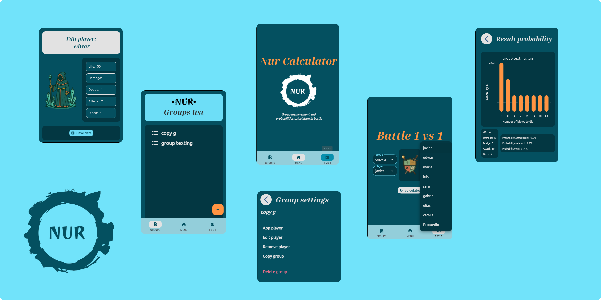

<h2 align="center"> Nur Calculator </h2>

## Table of Contents
- [Description](#description)
- [Features](#features)
- [Developer Information](#developer-information)
- [Installation](#installation)


##  Description 
For TTRPG (Tabletop Role-Playing Game) enthusiasts, [Nur](https://stivenreyesdesign.wixsite.com/nur-juego-de-rol) arrives, 
which not only boasts a great lore and immersive dynamics, but also comes with Nur Calculator, 
an Android app that provides the Game Master with assistance regarding battle balance in the campaigns they narrate.

##  Features

Nur Calculator is an app that allows the Game Master to create a database for both players and "monsters" (NPCs). 
From this database, it calculates the probabilities of winning a confrontation, whether between a player and an NPC, 
or a group of players against one or several NPCs.

Among the options offered by the app, there is the ability to create group lists, edit these lists 
(by adding more members, removing them, or editing their attributes).

Regarding probability calculation, this app shows the chances of rerolling in the attack phase, 
the number of possible damage values in which one can die and their respective probability, and the probability of 
winning after starting a combat.

As for the design, Nur Calculator presents a clean, intuitive, and easy-to-use interface.

<p align="center">
  
</p>

##  Developer Information
This app is entirely made in Python and uses the following dependencies:

```sh
pip install pandas numpy flet
```

## Installation
As the project is in development, links to the .apk will be available soon.


